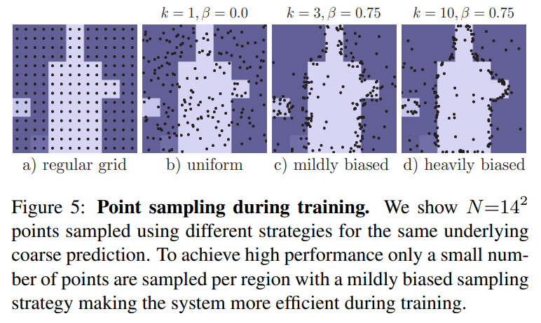

# PointRend

A PyTorch implementation of `PointRend: Image Segmentation as Rendering`


### [[arxiv]](https://arxiv.org/pdf/1912.08193.pdf) [Official Repo] : Detectron2 (unopend now)

<hr>

This repo for Only Semantic Segmentation on the PascalVOC dataset.

Many details differ from the paper for feasibilty check.

Implemented only Training codes not tested.

<hr>

## Reproduce Fig 5.

Sampled Points showing from different strategies on A Dog image.

See [sample_semantic.ipynb](tests/sample_semantic.ipynb)


Original Figure



Reference : [Pytorch Deeplab Tutorial](https://pytorch.org/hub/pytorch_vision_deeplabv3_resnet101/)

<hr>

## How to use:

First, fix data path in [default.yaml](config/default.yaml)

```
➜ python3 train.py -h
usage: train.py [-h] config save

PyTorch Object Detection Training

positional arguments:
  config      It must be config/*.yaml
  save        Save path in out directory

optional arguments:
  -h, --help  show this help message and exit
```

e.g.)
```
python3 train.py config/default.yaml test_codes
```

<hr>
